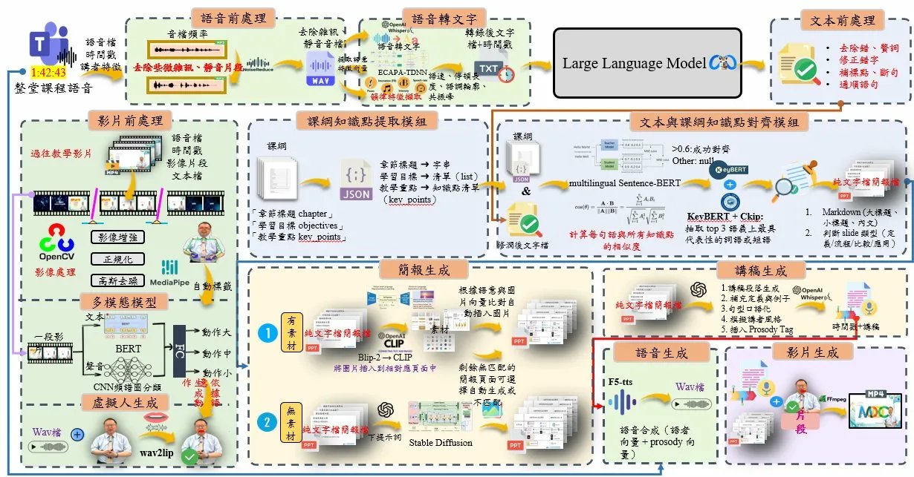

# 🎓 Automatic MOOCs Generation System Based on Speech

> **Master's Thesis** · All-English Master's Program in Intelligent Computing and Applications  
> Department of Computer Science and Information Engineering, **Tamkang University**  
> **Student:** Ya-Sin Guo (郭雅馨) · **Advisors:** Dr. Chih-Yung Chang (張志勇) · Dr. Shih-Jung Wu (武士戎) · 2025

[](https://python.org)
[](https://fastapi.tiangolo.com)
[](https://pytorch.org)
[](#cpu-deployment)
[](LICENSE)

---

## 📌 Overview

This system implements a **complete end-to-end automatic MOOCs lecture video generation pipeline**, transforming a raw classroom audio recording and optional teaching materials into a fully produced educational video — with no manual editing required.

**Key capabilities:**
- Accurate Traditional Chinese speech transcription (Whisper + ECAPA-TDNN speaker analysis)
- Syllabus-aware knowledge point extraction and semantic alignment
- Auto-generated PPTX slides with semantically matched images (BLIP-2 + CLIP)
- LLM-based instructor-style lecture script generation
- Personalized virtual lecturer video output (F5-TTS + wav2lip + FFmpeg)

**CPU deployment is fully supported.** All core modules run on CPU without a GPU. See the [CPU Deployment](#cpu-deployment) section for details.

---

## 🏗 System Architecture

<p align="center">
  
</p>
<p align="center"><b>Figure 1.</b> End-to-end pipeline of the proposed automatic MOOCs generation system.</p>

The system takes **four user inputs** and processes them through **six sequential modules**, as shown above.
 
### User Inputs
 
| # | Input | Required | Purpose |
|---|-------|----------|---------|
| ① | **Lecture Audio** (WAV / MP3 / M4A) | ✅ Required | The classroom recording to be converted into a MOOCs video |
| ② | **Teacher Video** (MP4 / AVI / MOV) | ✅ Required | Dual-use: (a) train the teacher action model, (b) extract teacher face for wav2lip lip sync. Best results with teacher on camera or green-screen virtual avatar. |
| ③ | **Course Syllabus** (text) | ✅ Required | Enables knowledge point extraction and structured slide generation |
| ④ | **Teaching Materials** | Optional | Image files (auto-assigned to slides via CLIP) and/or a custom `.pptx` template (system injects generated content into your layout) |

### Six Processing Modules

**① Audio Preprocessing + Speaker Analysis**  
Raw classroom audio is cleaned and transcribed in four sub-stages: background noise suppression (noisereduce) → silence removal (Silero-VAD) → speech recognition (Whisper ASR) → speaker identification (ECAPA-TDNN diarization). The output is a timestamped transcript with speaker labels and a teacher voiceprint database.

**② Text Cleaning** *(LLM post-processing)*  
The raw transcript is refined by an LLM (Ollama LLaMA3 local → GPT-4o cloud → rule-based fallback) to remove filler words, fix punctuation, and restore proper sentence structure — while preserving the instructor's natural speaking style.

**③ Knowledge Point Extraction & Syllabus Alignment**  
Each sentence in the cleaned transcript is encoded by multilingual Sentence-BERT and matched against the structured course syllabus using cosine similarity. An intelligent matching layer detects five relationship types (example, extension, application, contextual link, synonym). KeyBERT + CKIP extract the top keywords per matched sentence.

**④ Slide Generation**  
The transcript is paginated into slides guided by the knowledge point count. Images are inserted automatically: if the user supplies materials, BLIP-2 captions each image and CLIP ranks them by semantic similarity to the slide content; if no materials are provided, Stable Diffusion generates illustrations on demand.

**⑤ Script Generation** *(LLM)*  
An LLM writes a per-slide teaching script in Traditional Chinese — a warm opening for the first slide, a conversational teaching body for the middle slides, and a gratitude closing for the last.

**⑥ Voice Synthesis + Virtual Lecturer Video**  
The lecture script is converted to audio by F5-TTS (cloning the teacher's voice from a short reference recording), lip-synchronized to a face video by wav2lip, and composited with the slides into a final MP4 by FFmpeg. A **demo mode** is available for CPU-only environments.

**Pre-Training · Teacher Action Model** *(optional)*  
Historical videos are sliced into 5-second clips, skeleton features are extracted by MediaPipe, clips are auto-labeled by motion intensity (Q1/Q3 percentile thresholds), and a CNN+BERT multimodal model is trained to drive the virtual lecturer's body movements.

---

## 📁 Project Structure

```
moocs-auto-generator/
├── backend/
│   ├── main.py                     # FastAPI server — all REST + WebSocket endpoints
│   └── modules/
│       ├── preprocessing.py        # Modules 1+: AudioProcessor, VideoSlicer,
│       │                           #   SpeakerDiarizer (ECAPA-TDNN), TimeAligner
│       ├── action_modeling.py      # Pre-training: PoseAnalyzer, ActionLabeler,
│       │                           #   MultimodalActionModel, Trainer, Inference
│       ├── text_cleaner.py         # Module 2: Ollama / GPT-4o / rule-based cleaning
│       ├── syllabus_aligner.py     # Module 3: Sentence-BERT + KeyBERT + CKIP
│       ├── ppt_generator.py        # Module 4: BLIP-2 + CLIP + SD + python-pptx
│       └── pipeline.py             # Modules 5+6: ScriptGenerator,
│                                   #   VoiceVideoGenerator (demo+real), MOOCsPipeline
│
├── frontend/
│   ├── templates/
│   │   ├── index.html              # Simple UI — step-by-step cards, DM Sans
│   │   └── pro.html                # Pro UI — dark glass morphism, particle canvas
│   └── static/
│       ├── css/simple.css
│       ├── css/pro.css             # Space Grotesk + Syne + JetBrains Mono
│       ├── js/app.js               # Shared: WebSocket, all step handlers, demo+real
│       └── js/pro.js               # Pro-only: particles, scroll reveals, animations
│
├── docs/
│   └── architecture.png            # System architecture flowchart (Figure 1)
│
├── scripts/
│   └── run_real_pipeline.py        # CLI runner for real-mode pipeline (GPU)
│
├── output/                         # Runtime outputs — gitignored except README
│   └── README.md
│
├── .env.example                    # Environment variables template
├── requirements.txt
├── start.py                        # Quick launcher with environment check
├── .gitignore
└── README.md
```

---

## 🚀 Quick Start

### Prerequisites

| Requirement | Minimum | Recommended |
|-------------|---------|-------------|
| Python | 3.10 | 3.11 |
| RAM | 8 GB (demo mode) | 32 GB (real mode) |
| GPU | Not required | NVIDIA CUDA 12.1+ |
| OS | Windows 10 / macOS 12 / Ubuntu 20.04 | Ubuntu 22.04 |
| Ollama | Optional | Recommended (best LLM quality) |
| FFmpeg | Optional (demo only) | Required for real mode video |

### 1. Clone & Install

```bash
git clone https://github.com/<your-username>/moocs-auto-generator.git
cd moocs-auto-generator

python -m venv venv
source venv/bin/activate       # Linux / macOS
# venv\Scripts\activate        # Windows

pip install -r requirements.txt
```

> **GPU users only** — switch to a CUDA-enabled PyTorch build:
> ```bash
> pip install torch torchvision torchaudio \
>   --index-url https://download.pytorch.org/whl/cu121
> ```

> **CLIP** for image–slide alignment (optional):
> ```bash
> pip install git+https://github.com/openai/CLIP.git
> ```

### 2. Configure environment

```bash
cp .env.example .env
# Open .env and add OPENAI_API_KEY if you want GPT-4o (optional)
```

### 3. Set up Ollama (recommended)

```bash
# Install from https://ollama.com, then:
ollama pull llama3    # ~4.7 GB
ollama serve          # run in a separate terminal
```

### 4. Place your demo video

```
output/完整moocs影片產出.mp4    ← required for Step 6 demo mode
```

### 5. Launch

```bash
python start.py
```

| URL | Description |
|-----|-------------|
| `http://localhost:8000` | Simple UI — accessible, step-by-step |
| `http://localhost:8000/pro` | Pro UI — dark, animated, full-featured |
| `http://localhost:8000/docs` | FastAPI interactive API docs |

---


## 🎬 Demo Video

The following video demonstrates the complete output of the proposed system,
including slide generation, virtual lecturer synthesis, and audio-visual alignment.

📥 **Download Demo Video:**  
[完整moocs影片產出.mp4](output/完整moocs影片產出.mp4)

> This demo includes:
> - Automatically generated PPT slides
> - LLM-based lecture script
> - F5-TTS synthesized speech
> - wav2lip virtual lecturer
> - Subtitle alignment and final video composition

---
 
## 🖥 UI Versions
 
Two interfaces are included in the same project. Both are also available as an **interactive demo on GitHub Pages** — no installation required.
 
| Version | Live Demo | Local URL | Best for |
|---------|-----------|-----------|---------|
| **Simple UI** | [🔗 Try Simple Demo →](https://your-username.github.io/moocs-auto-generator/) | `http://localhost:8000` | First-time users, presentations |
| **Pro UI** | [🔗 Try Pro Demo →](https://your-username.github.io/moocs-auto-generator/) | `http://localhost:8000/pro` | Power users, showcasing |
 
> **Note:** The GitHub Pages demo simulates the full pipeline with animated progress steps. For real video generation, run locally with `python start.py`.
 
---
 
### Simple UI (`/`) — Clean & Accessible
 
<p align="center"></p>
 
Step-by-step card layout designed for clarity. Upload your files, configure settings, hit generate.
 
- **Font:** DM Sans + DM Mono · **Theme:** Light background, accessible color contrast
- Unified input area: audio + teacher video as primary inputs, syllabus + materials as optional
- Drag-and-drop upload for all file types, instant thumbnail preview for images
- Real-time progress bar with step indicators and log output
- Built-in theme selector (5 styles) or upload your own `.pptx` template
 
---
 
### Pro UI (`/pro`) — Dark & Animated
 
<p align="center"></p>
 
Full interactive experience built for showcasing and demos.
 
- **Font:** Space Grotesk + Syne + JetBrains Mono · **Theme:** Dark glass morphism + neon violet/cyan
- Animated particle network background (80 nodes with connection lines)
- Hero section with pipeline flow nodes — each node lights up as its step completes
- Scroll-triggered panel reveal animations, per-step flash transition on completion
- Orbital ring spinner overlay during processing
- Per-AI-model running indicator: shows exactly which model (Whisper / ECAPA-TDNN / Sentence-BERT / CLIP / F5-TTS / wav2lip) is active at any moment
- Sidebar configuration: LLM backend, video mode (demo/real), theme, template toggle
- Press `/` to focus Course Title
 
---

## 🎯 Step-by-Step Usage

### Step 0 · Train Action Model *(optional)*

Upload a historical lecture video. The system slices it into 5-second clips, extracts MediaPipe 33-joint skeleton features, auto-labels motion intensity via Q1/Q3 percentile thresholds, and trains a CNN+BERT multimodal classifier.

Output: `output/training/best_action_model.pth`

### Step 1 · Audio Preprocessing

**Input:** WAV / MP3 / M4A / FLAC

Pipeline stages:
1. **noisereduce** — non-stationary background noise suppression
2. **Silero-VAD** — removes silence and non-speech segments
3. **Whisper large-v3** (GPU) / **base** (CPU) — Chinese ASR → timestamped segments
4. **OpenCC s2tw** — Simplified → Traditional Chinese conversion

**Output:** Transcription text + `[{start, end, text}]` segments + speaker annotations

### Step 2 · Text Cleaning

**Input:** Raw Whisper transcription

Removes filler words (嗯、那個、就是、然後…), fixes punctuation, restores sentence breaks. Backend priority:

1. Ollama LLaMA3 — local, private
2. OpenAI GPT-4o — cloud (requires `OPENAI_API_KEY`)
3. Rule-based — automatic fallback

**Output:** Cleaned Traditional Chinese transcript

### Step 3 · Syllabus Alignment *(optional)*

**Syllabus format:**
```
Chapter Title
Chapter 1: Data Structures

Learning Objectives
1. Understand arrays and linked lists

Key Points
Sorting algorithms
Time complexity: O(n), O(log n)
```
Sub-points supported: `Main concept：sub1、sub2`

**Alignment modes:**

| Mode | Threshold | Match types |
|------|-----------|-------------|
| Traditional | ≥ 0.6 | Direct cosine match |
| Intelligent (default) | ≥ 0.42 | + example / extended / application / contextual / synonym |

**Output:** Per-sentence KP annotation + Top-3 keywords (KeyBERT + CKIP) + coverage rate

### Step 4 · Slide Generation

**Image strategy (auto-selected):**

| Strategy | Condition | Method |
|----------|-----------|--------|
| A | User uploads images | BLIP-2 caption → CLIP ranking → best image per slide |
| B | No images + SD on | Stable Diffusion `txt2img` → 512×512 illustration per slide |
| C | Partial images | CLIP for matched slides; SD for remaining |

**Themes:** Modern Blue · Academic Green · Elegant Purple · Tech Gray · Warm Orange

**Output:** `.pptx` (10×7.5 inches, cover + content slides + page numbers)

### Step 5 · Script Generation

| Slide | Content | Duration |
|-------|---------|----------|
| First | Opening — greeting + topic preview | ~1–2 min |
| Middle | Teaching body — explanations + examples | ~12–15 min per slide |
| Last | Closing — summary + 「謝謝大家的聆聽」 | ~2 min |

**Output:** Full `.txt` script + per-slide `{title, bullets, script}`

### Step 6 · Video Generation

**Demo mode** (default, CPU-compatible): simulates the pipeline with real-time progress messages, then serves the pre-placed demo video.

**Real mode** (GPU + additional tools):

```
F5-TTS → wav2lip → FFmpeg
Voice clone   Lip sync   Slides + PiP + subtitles → MP4
```

Enable in Pro UI sidebar (⚡ Real) or via CLI:
```bash
python scripts/run_real_pipeline.py \
  --audio lecture.wav --ref teacher_ref.wav --face teacher.mp4
```

---

## 🌐 API Reference

| Method | Endpoint | Description |
|--------|----------|-------------|
| `GET` | `/` | Simple UI |
| `GET` | `/pro` | Pro UI |
| `GET` | `/api/health` | Health check |
| `GET` | `/api/status` | Backend availability (Ollama / OpenAI / SD / F5-TTS / wav2lip / FFmpeg) |
| `WS` | `/ws/{session_id}` | Real-time progress push |
| `POST` | `/api/train/action-model` | Pre-training pipeline |
| `POST` | `/api/step/audio` | Module 1 — audio preprocessing |
| `POST` | `/api/step/clean` | Module 2 — text cleaning |
| `POST` | `/api/step/align` | Module 3 — syllabus alignment |
| `POST` | `/api/step/upload-images` | Upload image materials |
| `POST` | `/api/step/ppt` | Module 4 — slide generation |
| `POST` | `/api/step/script` | Module 5 — script generation |
| `POST` | `/api/step/video` | Module 6 (`video_mode=demo\|real`) |
| `POST` | `/api/pipeline/run` | One-click full pipeline |
| `GET` | `/api/download/{filename}` | Download output file |
| `GET` | `/api/stream/{filename}` | Stream video |

---

## 🔧 Full Deployment (Real Mode)

### F5-TTS

```bash
pip install f5-tts

from f5_tts.infer.utils_infer import infer_process
audio = infer_process(ref_audio="teacher.wav", ref_text="", gen_text=script)
```

### wav2lip

```bash
git clone https://github.com/Rudrabha/Wav2Lip
pip install -r Wav2Lip/requirements.txt
# Download wav2lip_gan.pth → Wav2Lip/checkpoints/

python Wav2Lip/inference.py \
  --checkpoint_path Wav2Lip/checkpoints/wav2lip_gan.pth \
  --face teacher.mp4 --audio synthesized.wav --outfile lipsync.mp4
```

### Stable Diffusion WebUI

```bash
git clone https://github.com/AUTOMATIC1111/stable-diffusion-webui
./webui.sh --api --listen
# Connects to http://127.0.0.1:7860
```

---

## 🖥 CPU Deployment

| Module | CPU | Notes |
|--------|-----|-------|
| Whisper ASR | ✅ | Auto-selects `base` model (~140 MB); `large-v3` requires GPU |
| Silero-VAD | ✅ | PyTorch, no CUDA needed |
| noisereduce | ✅ | NumPy-based |
| ECAPA-TDNN (speechbrain) | ✅ | Slower; falls back to single-speaker mode if not installed |
| MediaPipe skeleton | ✅ | CPU-optimized |
| Sentence-BERT | ✅ | ~0.2s/sentence on CPU |
| KeyBERT + CKIP | ✅ | First run downloads ~400 MB |
| CLIP image alignment | ✅ | ~1s/image on CPU |
| BLIP-2 captioning | ⚠️ | Very slow on CPU; CLIP alone is recommended |
| Stable Diffusion | ⚠️ | ~5–10 min/image on CPU; GPU recommended |
| F5-TTS (real mode) | ⚠️ | Demo mode is the recommended option on CPU |
| wav2lip (real mode) | ⚠️ | Short clips work on CPU; GPU recommended for full lectures |

**Recommended CPU-only workflow:** run demo mode for Step 6; use CLIP without BLIP-2; pre-download models before first use.

---

## 📊 Experimental Results

Evaluated on LectureBank, Wikipedia Corpus, and PubLayNet.

| Module | Metric | This System | Baseline |
|--------|--------|-------------|---------|
| Action Classification | Accuracy | **78.6%** | TAVT: 68.2% |
| Syllabus Alignment | Coverage Rate | **87.3%** | Jiang et al.: 72.1% |
| Syllabus Alignment | Semantic Accuracy | **0.83** | Xie et al.: 0.71 |
| Slide Generation | Structural Integrity | **4.2 / 5** | PASS: 3.5 / 5 |
| Slide Generation | Topic Coherence | **0.89** | SlideFormer: 0.76 |

**Setup:** NVIDIA RTX 4090 · Intel Core i9-12900K · 128 GB DDR4 · Ubuntu 22.04 · CUDA 12.1 · PyTorch 2.0

---

## ❓ FAQ

**Silero-VAD download fails on first run?**
```bash
python -c "import torch; torch.hub.load('snakers4/silero-vad', 'silero_vad')"
```

**Whisper is slow on CPU?**  
CPU mode auto-selects the `base` model. For higher accuracy, install CUDA PyTorch — `large-v3` activates automatically when a GPU is detected.

**CKIP takes long on first run?**
```bash
python -c "from ckip_transformers.nlp import CkipWordSegmenter; CkipWordSegmenter('bert-base')"
```

**⚡ Real Mode button is grayed out?**  
Check `/api/status` — `real_mode_ready` must be `true`. Requires: `pip install f5-tts`, wav2lip repo + `wav2lip_gan.pth`, and `ffmpeg` on PATH.

**No Ollama — will the system work?**  
Yes. Text cleaning falls back to rule-based processing; syllabus alignment uses Sentence-BERT with no LLM dependency. Ollama improves output quality but is not required.

**BLIP-2 download is 15 GB?**  
BLIP-2 is optional. CLIP alone provides solid image-to-slide alignment on CPU. Skip BLIP-2 unless you have sufficient GPU memory.

---

## 📄 Citation

```bibtex
@mastersthesis{guo2025moocs_graduation_thesis,
  title   = {Automatic MOOCs Generation System Based on Speech},
  author  = {Guo, Ya-Sin},
  school  = {Tamkang University},
  year    = {2025},
  advisor = {Chang, Chih-Yung and Wu, Shih-Jung},
}
```

---

<div align="center">

**Technology Stack**

Whisper · Silero-VAD · ECAPA-TDNN · OpenCC · MediaPipe  
BERT · Sentence-BERT · KeyBERT · CKIP · BLIP-2 · CLIP · Stable Diffusion  
LLaMA3 · GPT-4o · F5-TTS · wav2lip · python-pptx · FFmpeg · FastAPI

**Tamkang University · Department of CSIE · All-English Master's Program · Yasin's 2025 master graduation thesis**

</div>
